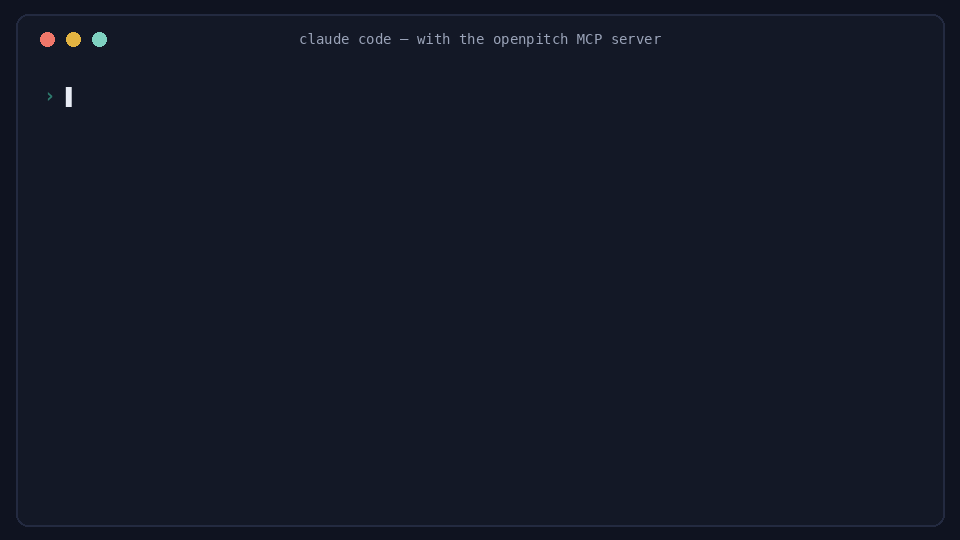

<div align="center">

# 🪧 OpenPitch

**The open, real-time intelligence layer for AI startups — that any agent can build on.**

*A free, open-source alternative to PitchBook & CB Insights, focused on the AI companies VCs actually care about.*

`MCP-native` · `zero-cost` · `fully-sourced` · `updated daily`

[](https://github.com/Avierovich/openpitch/actions/workflows/ci.yml)
[](https://pypi.org/project/openpitch/)
[](https://pypi.org/project/openpitch/)
[](LICENSE)

> **Status: v0.1.2 — functional.** The pipeline, reconciliation engine, MCP server, and
> dashboard all work end-to-end. Coverage and source breadth keep growing via the daily run.



[**Browse the live dashboard →**](https://avierovich.github.io/openpitch/)

</div>

---

## Why OpenPitch exists

PitchBook and CB Insights cost **$20k+/year** — and for fast-moving AI startups, their data is often **months stale**, because human verification is slow. For a company growing 3× a year, a figure verified six months ago can be off by multiples.

Meanwhile, the real numbers are **already public**: founders state ARR on podcasts weeks before any database, funding hits SEC filings, hiring velocity reveals growth. They're just scattered, unstructured, and contradictory — exactly the problem an AI agent is built to solve.

**OpenPitch's bet is latency, not coverage.** For the AI companies that matter, a *fresh, fully-sourced, confidence-scored* number beats a *verified-but-stale* one. We don't claim certainty — we show you the receipts.

## What you get

Ask your coding agent, get an answer with receipts:

```
> what's Sierra's valuation, with sources?

  Sierra — AI agents for customer service (sierra.ai)
  Valuation  $15.4B  [consensus · confidence 0.96] · as of 2026-05
  ↳ 10 public sources · Reuters · CNBC · The Information · qz.com
  ↳ $950M round closed May 2026 — led by Tiger Global and GV
```

*(A real answer from the committed data — check it against the [live dashboard](https://avierovich.github.io/openpitch/).)*

Every number carries **its source, a confidence score, and a tracked history** of how it changed.

## Features

- 🎙️ **Mines podcasts** — founders leak metrics on podcasts before any database catches them. We transcribe and extract them.
- 🧾 **Always sourced** — every figure links to its origin (podcast timestamp, filing, article). No black-box numbers.
- 📊 **Confidence-scored** — built from source reliability, speaker authority, corroboration, and freshness (confidence *decays* as data ages).
- 🔀 **Reconciles conflicts** — when sources disagree, you get a consensus range + a contradiction flag, not a silent guess.
- 🧠 **Learns which sources to trust** — sources that prove right over time earn more weight.
- 🕒 **Version-tracked** — the git history *is* the audit log. See exactly how a company's reported ARR evolved.
- 📡 **Composable** — emits typed events other agents subscribe to (newsletters, press alerts, investor outbound).
- 🤝 **A2A-discoverable** — ships an A2A agent card so agent ecosystems can find and describe it.
- 🧯 **Grounding** — give your AI a sourced, confidence-scored fact base so it stops making up AI-company numbers.
- ⚡ **60-second install** — no key, no signup; works in your agent in under a minute.
- 💸 **Genuinely free** — runs entirely on free tiers. No cost to run, no cost to use.

## Quickstart — use it in Claude Code / Codex

**No API key. No signup. No cost.** The data is already built and committed; the MCP server just reads it, and *your* agent does the reasoning.

**Fastest — zero install** (reads the committed data from the public repo, no clone):

```bash
uvx openpitch-mcp
```

**Or install the package:**

```bash
pip install openpitch          # the MCP server (mcp is a core dependency)
openpitch-mcp                  # start the read-only server
```

**Or run from a clone** (for the pipeline / to rebuild data):

```bash
git clone https://github.com/Avierovich/openpitch && cd openpitch
python -m venv .venv && source .venv/bin/activate
pip install -e ".[pipeline]"   # core + pipeline LLM deps
openpitch seed                 # build the data/ database from the committed seed (offline, no key)
```

Then point your agent at the local server:

```jsonc
// MCP config (Claude Code / Codex) — zero-install via uvx:
{
  "mcpServers": {
    "openpitch": { "command": "uvx", "args": ["openpitch-mcp"] }
  }
}
// (or "command": "openpitch-mcp" if you pip-installed the package)
```

Ask your agent: *"What's Cognition's ARR, with sources and confidence?"* — it calls `get_metric`/`get_provenance` and answers from committed data (and will flag the public-source discrepancy).

### Or just browse the data
- 🌐 **Live dashboard** — [avierovich.github.io/openpitch](https://avierovich.github.io/openpitch/) (sourced company cards, refreshed daily) — or build locally: `openpitch build-dashboard`
- 📁 **Raw data** — [`data/companies/`](data/) — plain JSON, diffable, yours to use
- 🤝 **A2A Agent Card** — generated at `dashboard/dist/.well-known/agent.json`

> **Data status:** live, refreshed daily by CI. Figures are **probabilistic, public-source intelligence** — every number carries its source, confidence score, and date, and open quality items are [tracked in public](https://avierovich.github.io/openpitch/quality.html). See the [methodology](docs/METHODOLOGY.md) and the [correction workflow](docs/CORRECTIONS.md).

## Docs

- **Trust model** — [methodology](docs/METHODOLOGY.md) · [data policy](docs/DATA-POLICY.md) · [corrections](docs/CORRECTIONS.md)
- **Interfaces** — [MCP spec](docs/MCP-SPEC.md) · [events spec](docs/EVENTS-SPEC.md)
- **Architecture** — [full design doc](docs/FRD.md) · more product docs in [`docs/`](docs/)

## How it works

```
  Sources              Daily pipeline (free GitHub Actions)         Interfaces
  ──────────           ───────────────────────────────────         ──────────
  Podcasts ─┐          1. select top-50 (VC-attention score)        ┌─ MCP server (local, BYO agent)
  News ─────┤    ───▶  2. collect · 3. transcribe · 4. extract ───▶ ├─ static dashboard
  SEC EDGAR ┤          5. reconcile · 6. score sources              ├─ event feed (JSONL)
  Web ──────┘          7. publish → git commit (the database)       └─ "what moved today" digest
```

The git repo **is** the database. There's no server to run. See the [FRD](docs/FRD.md) for the full design.

## Build on it (composability)

OpenPitch emits typed, confidence-scored **events** when something material changes — so other agents can react:

| You're building… | Subscribe to | OpenPitch becomes… |
|---|---|---|
| A newsletter agent | all material events | your content pipeline's data source |
| A press/PR workflow | funding/valuation events, confidence ≥ 0.8 | your "time to call the company" trigger |
| Investor outbound | universe entries, growth thresholds | your targeting signal |

Events ship on MCP and a raw `events/feed.jsonl`. Schemas are versioned. See the [events spec](docs/EVENTS-SPEC.md).

## How we compare

OpenPitch is **complementary to the incumbents, not a rip-and-replace.** We win a narrow wedge; we lose on breadth and verification — and we're honest about both.

| | PitchBook / CB Insights | Crunchbase | Harmonic | MAGNiTT / Wamda | **OpenPitch** |
|---|:--:|:--:|:--:|:--:|:--:|
| Price | $20k–100k/yr | Freemium | Custom | $/regional | **Free & open** |
| Freshness | Weeks–months | Variable | Days | Weeks | **Daily** |
| In your AI agent (MCP) | ✗ | ✗ | ◐ | ✗ | **✓** |
| Every figure sourced + confidence-scored | ◐ | ◐ | ◐ | ◐ | **✓** |
| Contradiction detection | ✗ | ✗ | ✗ | ✗ | **✓** |
| Coverage breadth | **✓✓✓** | **✓✓✓** | **✓✓** | ✓ (MENA) | narrow (by design) |
| Verified, diligence-grade | **✓** | ◐ | ◐ | ◐ | ✗ (probabilistic) |

**The honest pitch:** *the free, fresh, AI-native first look — every number sourced — before you pull the expensive verified report.* For an investment decision, you still need the incumbents. Full mapping, feature matrix & pricing: [docs/COMPETITIVE-ANALYSIS.md](docs/COMPETITIVE-ANALYSIS.md) · [spreadsheet](docs/competitive-matrix.xlsx).

## Coverage

**Global AI startups** — **140+ profiled** across 12 sectors (including Chinese AI labs and European names Western trackers miss), with a **top 50 dynamically ranked** by VC attention (valuation + funding activity — *not* ARR, to avoid circularity). The list moves as attention shifts; companies entering/leaving the top 50 is itself a tracked signal, and auto-discovery grows the universe daily.

**MENA AI/tech segment** — a dedicated regional set (an open, AI-native alternative to MAGNiTT/Wamda). Honest caveat: MENA disclosure is lighter than the US, so this segment launches with lower confidence/coverage, clearly labeled.

Seed universe: [`config/watchlist.yaml`](config/watchlist.yaml).

## Honest disclaimer

OpenPitch is **transparently probabilistic**. Many figures are estimates derived from public, self-reported, sometimes-contradictory sources. We surface confidence and provenance precisely so you can judge for yourself. **This is not investment advice, and figures are not guaranteed accurate.** Always verify before acting.

## Roadmap

- [x] Seed universe (global AI + MENA segment) + auto-discovery (news, funding digests, 21-sector backfill, China feed)
- [x] Core data model + reconciliation engine (confidence, consensus, contradiction) — *tested*
- [x] Source adapters: podcast, news, EDGAR, company-site — *tested*
- [x] Extraction stage: batched LLM claim extraction + model rotation — *tested; data QA still required*
- [x] MCP server — local read-only data tools
- [x] Daily GitHub Actions pipeline — wired for LLM, Groq transcription, and SEC user-agent secrets
- [x] Static dashboard + company pages — generated from committed data
- [x] Event feed — JSONL feed and digest generated from publishes
- [x] A2A agent discovery card — generated with dashboard
- [ ] MENA adapters (regional news, free-zone registries)
- [ ] Rich-source expansion (GitHub, hiring, app-ranks) — *post-PMF scaling*
- [ ] *v2:* implied-ARR model, intra-day funding fast-lane

## Contributing

Contributions welcome — especially **new source adapters** (one file each) and **watchlist curation**. See the [FRD](docs/FRD.md) for architecture.

## License

[MIT](LICENSE)

---

<div align="center">
<sub>Built in the open. Free forever. If a number looks wrong, open an issue — provenance means you can check our work.</sub>

<!-- mcp-name: io.github.Avierovich/openpitch -->
</div>
